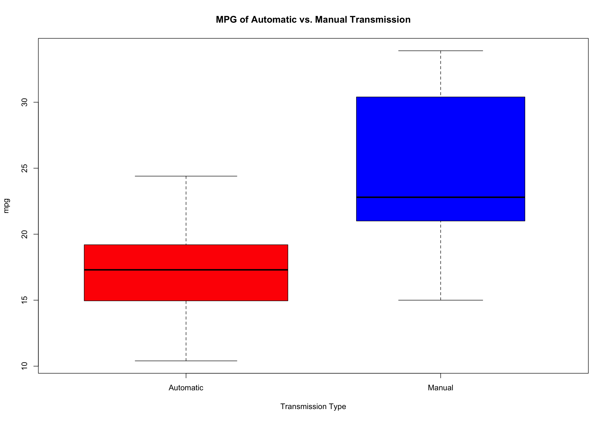
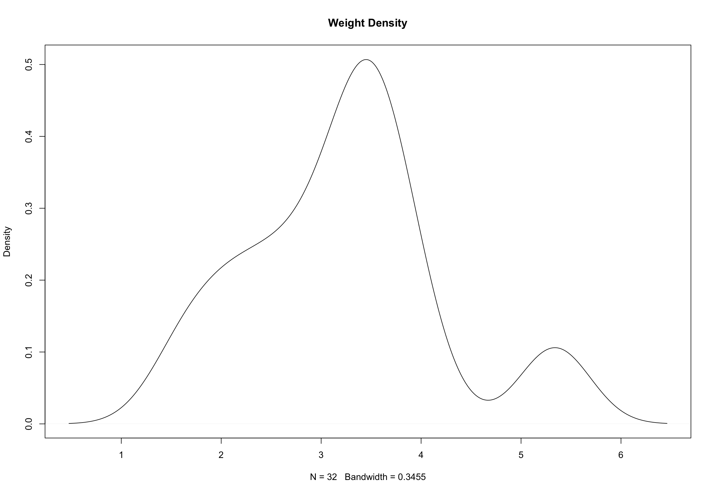
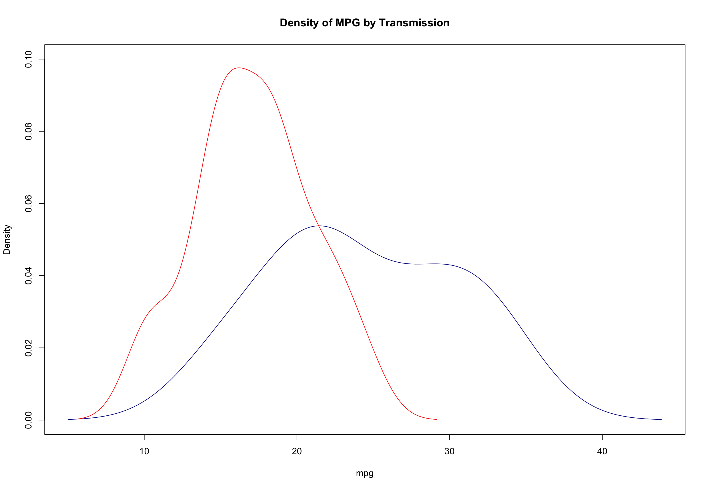
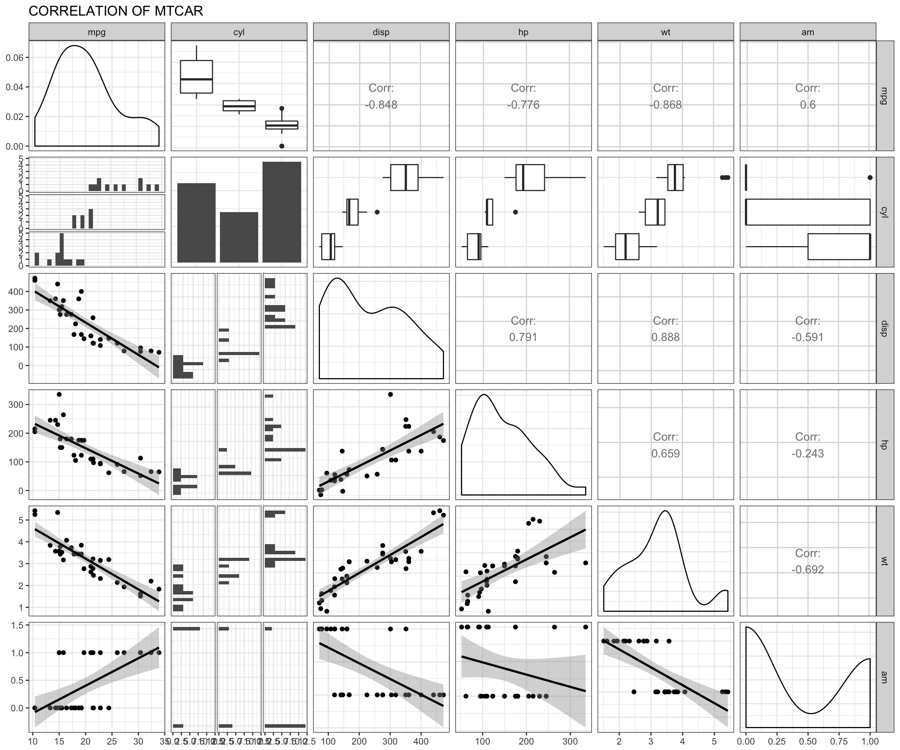
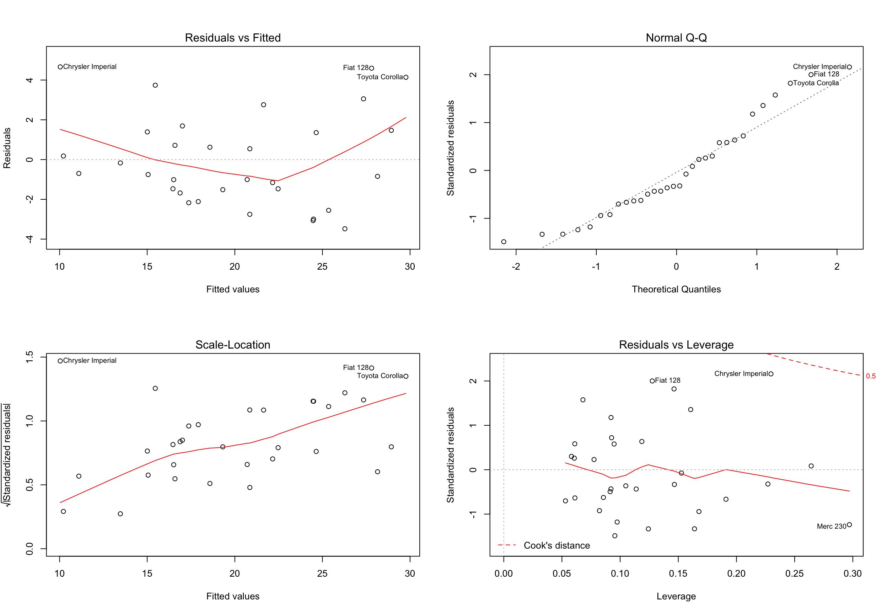
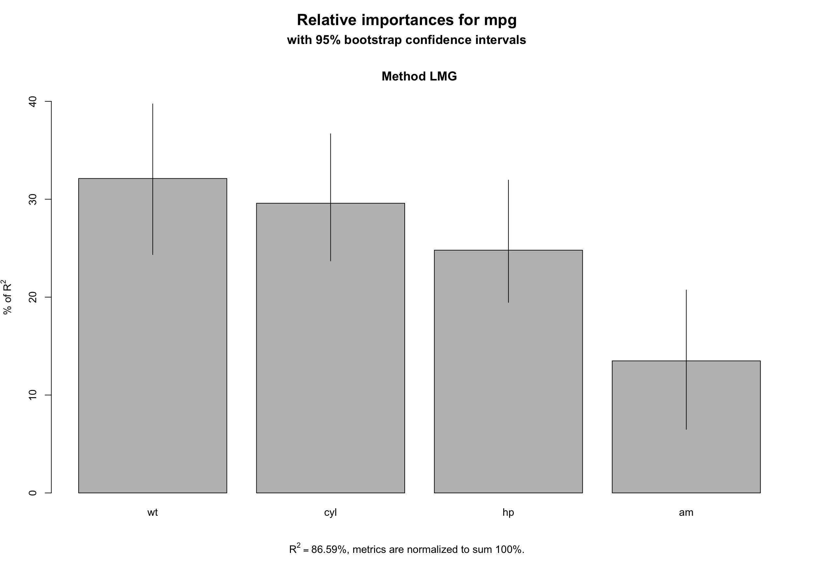

#### Executive Summary

From this analysis we found out that manual transmission are better in per gallon than automatic transmission.  With 95% confidence, we estimate that a the change from automatic to manual transmission results in a 2.2 to 6.39 increase in miles per gallon for the cars. A linear regression model determined by ANOVA explained that 84% of the variation in mpg.  We have conclude that manual transmission are better than automatic in terms of Miles per gallon

#### MGP of Automatic and Manual Transmission
You work for Motor Trend, a magazine about the automobile industry. Looking at a data set of a collection of cars, they are interested in exploring the relationship between a set of variables and miles per gallon (MPG) (outcome). They are particularly interested in the following two questions:

1. "Is an automatic or manual transmission better for MPG""
2. "Quantify the MPG difference between automatic and manual transmissions"

#### Dataset
*mtcars*

The data was extracted from the 1974 Motor Trend US magazine, and comprises fuel consumption and 10 aspects of automobile design and performance for 32 automobiles (1973-74 models).

#### Format Description
A data frame with 32 observations on 11 variables.

Col | label | Description
---|---|---
[, 1] |	mpg	| Miles/(US) gallon
[, 2]	| cyl |	Number of cylinders
[, 3]	|	disp | Displacement (cu.in.)
[, 4]	|	hp | Gross horsepower 
[, 5]	|	drat |	Rear axle ratio 
[, 6]	|	wt |	Weight (1000 lbs) 
[, 7]	|	qsec | 1/4 mile time 
[, 8]	|	vs | V/S 
[, 9]	|	am | Transmission (0 = automatic, 1 = manual) 
[,10]	| gear | Number of forward gears 
[,11]	| carb | Number of carburetors

#### Processing the Data

We will use gear, vs, carb, cyl and am for the analysis with proper factor and numeric.
Separating Automatic and Manual Transmission.


#### Comparing MGG with Automatic Versus Manual Transmission

We display a boxplot to show that there is a difference between Automatic and Manual Transmission with MPG.  From the plot we can clearly see that there is an increase in MPG with manual transmission.



#### Density Plot for Weight

This plot reveals that the difference between the means illustrated earlier has one important cause: the weight is correlated with the number of miles per galleon and the cars with automatic transmission are on average lighter than the cars with manual transmission. 




#### Density Plot Between Automatic & Manual Transmission

The *red* represent automatic and *blue* represent manual transmission



#### Pair Plot

We see there are correlations between these variables showing significantly against each other.



#### Building the Model

We will use simple linear regression and multivariate regression analysis to build the regression model for this dataset.

##### Simple Linear Regression

Use mpg as the dependent variable and am as the independent variable to fit a linear regression.


```
## 
## Call:
## lm(formula = mpg ~ am, data = mtcars)
## 
## Residuals:
##     Min      1Q  Median      3Q     Max 
## -9.3923 -3.0923 -0.2974  3.2439  9.5077 
## 
## Coefficients:
##             Estimate Std. Error t value Pr(>|t|)    
## (Intercept)   17.147      1.125  15.247 1.13e-15 ***
## am             7.245      1.764   4.106 0.000285 ***
## ---
## Signif. codes:  0 '***' 0.001 '**' 0.01 '*' 0.05 '.' 0.1 ' ' 1
## 
## Residual standard error: 4.902 on 30 degrees of freedom
## Multiple R-squared:  0.3598,	Adjusted R-squared:  0.3385 
## F-statistic: 16.86 on 1 and 30 DF,  p-value: 0.000285
```

##### Multivariate Regression Analysis

The following step function will find the best model.


```
## 
## Call:
## lm(formula = mpg ~ cyl + hp + wt + am, data = mtcars)
## 
## Residuals:
##     Min      1Q  Median      3Q     Max 
## -3.9387 -1.2560 -0.4013  1.1253  5.0513 
## 
## Coefficients:
##             Estimate Std. Error t value Pr(>|t|)    
## (Intercept) 33.70832    2.60489  12.940 7.73e-13 ***
## cyl6        -3.03134    1.40728  -2.154  0.04068 *  
## cyl8        -2.16368    2.28425  -0.947  0.35225    
## hp          -0.03211    0.01369  -2.345  0.02693 *  
## wt          -2.49683    0.88559  -2.819  0.00908 ** 
## am           1.80921    1.39630   1.296  0.20646    
## ---
## Signif. codes:  0 '***' 0.001 '**' 0.01 '*' 0.05 '.' 0.1 ' ' 1
## 
## Residual standard error: 2.41 on 26 degrees of freedom
## Multiple R-squared:  0.8659,	Adjusted R-squared:  0.8401 
## F-statistic: 33.57 on 5 and 26 DF,  p-value: 1.506e-10
```

##### Capture 84% of the total variance

This model explains 84% of the variance in miles per gallon (mpg). Moreover, we see that wt and qsec did indeed confound the relationship between am and mpg (mostly wt). Now when we read the coefficient for am, we say that, on average, manual transmission cars have 2.94 MPGs more than automatic transmission cars. However this effect is much lower than when we did not adjust for weight and qsec.


```
## Analysis of Variance Table
## 
## Model 1: mpg ~ am
## Model 2: mpg ~ am + wt + qsec
##   Res.Df    RSS Df Sum of Sq      F   Pr(>F)    
## 1     30 720.90                                 
## 2     28 169.29  2    551.61 45.618 1.55e-09 ***
## ---
## Signif. codes:  0 '***' 0.001 '**' 0.01 '*' 0.05 '.' 0.1 ' ' 1
```


```
## 
## Call:
## lm(formula = mpg ~ am + wt + qsec, data = mtcars)
## 
## Residuals:
##     Min      1Q  Median      3Q     Max 
## -3.4811 -1.5555 -0.7257  1.4110  4.6610 
## 
## Coefficients:
##             Estimate Std. Error t value Pr(>|t|)    
## (Intercept)   9.6178     6.9596   1.382 0.177915    
## am            2.9358     1.4109   2.081 0.046716 *  
## wt           -3.9165     0.7112  -5.507 6.95e-06 ***
## qsec          1.2259     0.2887   4.247 0.000216 ***
## ---
## Signif. codes:  0 '***' 0.001 '**' 0.01 '*' 0.05 '.' 0.1 ' ' 1
## 
## Residual standard error: 2.459 on 28 degrees of freedom
## Multiple R-squared:  0.8497,	Adjusted R-squared:  0.8336 
## F-statistic: 52.75 on 3 and 28 DF,  p-value: 1.21e-11
```

#### Residual Diagnostics

Residual plot will check for non-normality and examine any heteroskedacity between the fitted and residual values.



#### Bootstrapping

This will interpret the importance of variables 
This will show that Automatic Transmission is the least important among these variables around 14%.


```
## 
## Call:
## lm(formula = mpg ~ cyl + hp + wt + am, data = mtcars)
## 
## Residuals:
##     Min      1Q  Median      3Q     Max 
## -3.9387 -1.2560 -0.4013  1.1253  5.0513 
## 
## Coefficients:
##             Estimate Std. Error t value Pr(>|t|)    
## (Intercept) 33.70832    2.60489  12.940 7.73e-13 ***
## cyl6        -3.03134    1.40728  -2.154  0.04068 *  
## cyl8        -2.16368    2.28425  -0.947  0.35225    
## hp          -0.03211    0.01369  -2.345  0.02693 *  
## wt          -2.49683    0.88559  -2.819  0.00908 ** 
## am           1.80921    1.39630   1.296  0.20646    
## ---
## Signif. codes:  0 '***' 0.001 '**' 0.01 '*' 0.05 '.' 0.1 ' ' 1
## 
## Residual standard error: 2.41 on 26 degrees of freedom
## Multiple R-squared:  0.8659,	Adjusted R-squared:  0.8401 
## F-statistic: 33.57 on 5 and 26 DF,  p-value: 1.506e-10
```



#### Conclusion

With 95% confidence, we estimate that a the change from automatic to manual transmission results in a 2.2 to 6.39 increase in miles per gallon for the cars. There is also a difference in mgp with transmission type.  Therefore in conclusion, the manual transmission is better than automatic transmission for mpg.


```
##                Estimate  Std. Error     t value   Pr(>|t|)
## (Intercept) 23.87913244 20.06582026  1.19004018 0.25252548
## cyl6        -2.64869528  3.04089041 -0.87102622 0.39746642
## cyl8        -0.33616298  7.15953951 -0.04695316 0.96317000
## disp         0.03554632  0.03189920  1.11433290 0.28267339
## hp          -0.07050683  0.03942556 -1.78835344 0.09393155
## drat         1.18283018  2.48348458  0.47627845 0.64073922
## wt          -4.52977584  2.53874584 -1.78425732 0.09461859
## qsec         0.36784482  0.93539569  0.39325050 0.69966720
## vs1          1.93085054  2.87125777  0.67247551 0.51150791
## am           1.21211570  3.21354514  0.37718957 0.71131573
## gear4        1.11435494  3.79951726  0.29328856 0.77332027
## gear5        2.52839599  3.73635801  0.67670068 0.50889747
## carb2       -0.97935432  2.31797446 -0.42250436 0.67865093
## carb3        2.99963875  4.29354611  0.69863900 0.49546781
## carb4        1.09142288  4.44961992  0.24528452 0.80956031
## carb6        4.47756921  6.38406242  0.70136677 0.49381268
## carb8        7.25041126  8.36056638  0.86721532 0.39948495
```


```
##       Estimate Std. Error   t value     Pr(>|t|)
## wt   -3.185455  0.4827586 -6.598442 3.128844e-07
## qsec  1.599823  0.1021276 15.664944 1.091522e-15
## am    4.299519  1.0241147  4.198279 2.329423e-04
```


```
## [1] 2.204969 6.394069
```
